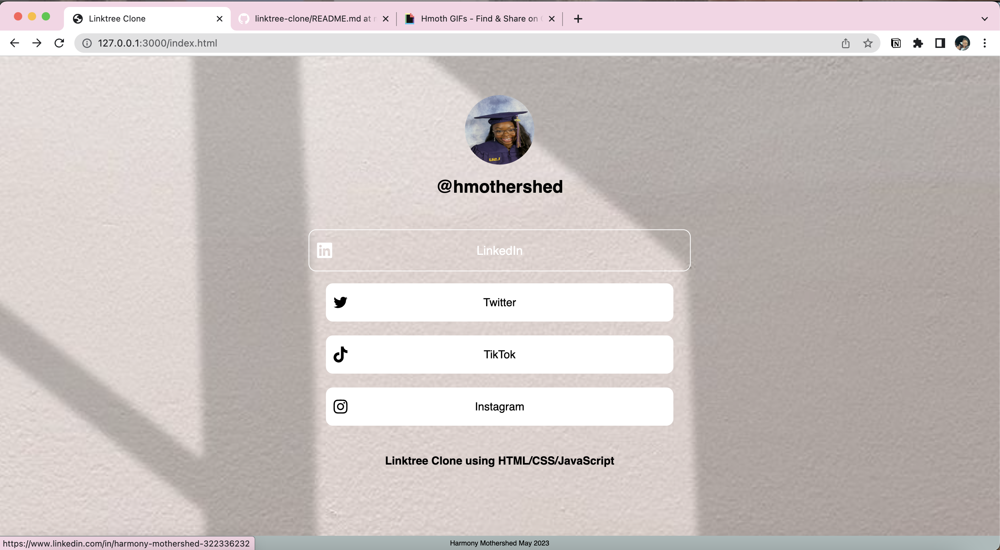

# Linktree Clone
This is a simple Linktree clone created using HTML, CSS, and JavaScript. It allows you to showcase multiple links to your social media profiles or websites in a single location, similar to Linktree.

## Features

- Display a profile picture and username
- List multiple links with corresponding icons and titles
- Open links in new tabs
- Responsive design for various screen sizes

## Demo
Here's a live demo of the Linktree Clone

https://github.com/hmothershed/linktree-clone/assets/112271331/67f70de6-eca8-4a3e-ac04-0c6ecbf1ac06

## Customization
To customize the Linktree Clone for your own use, you can modify the following files:

- index.html: Update the profile picture, username, and links.
- style.css: Customize the styles, colors, and layout as needed.
- Replace the SVG icons in the img directory with your own icons if desired.

## Acknowledgments
This project was inspired by the concept and design of Linktree (https://linktr.ee). Special thanks to the creators and contributors of the open-source libraries and resources used in this project.
